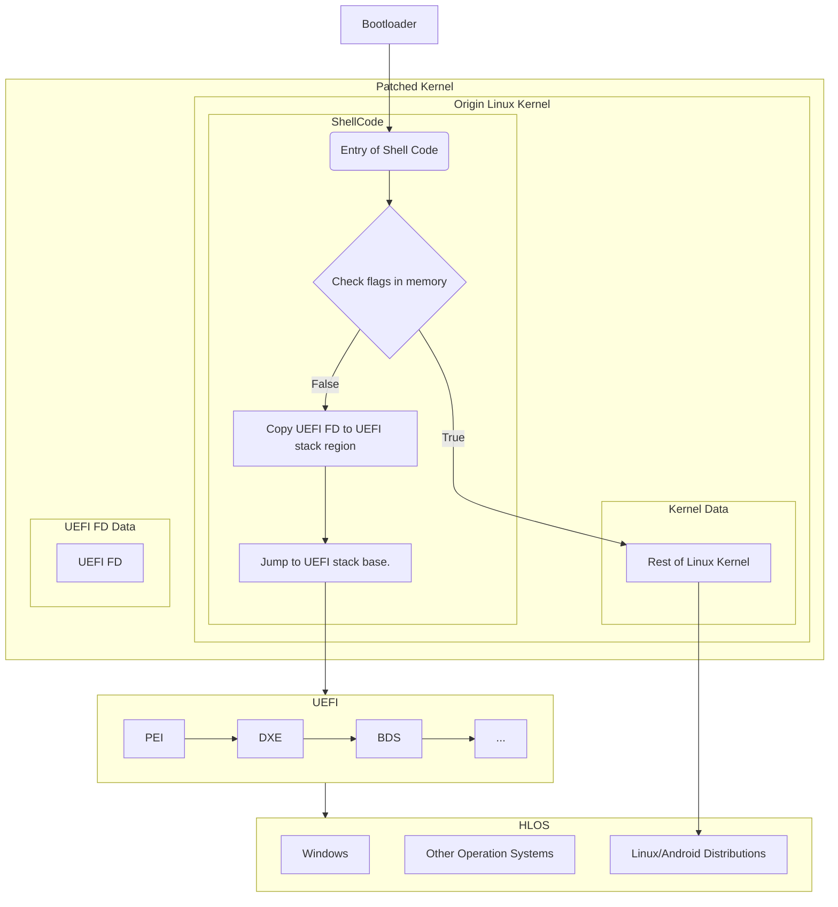
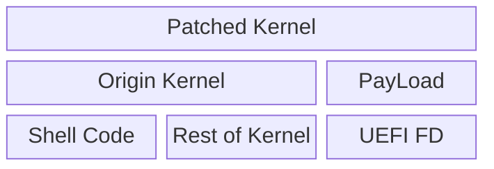

## DualBoot Kernel Patcher
> Based on [SurfaceDuoDualBootKernelImagePatcher](https://github.com/WOA-Project/SurfaceDuoDualBootKernelImagePatcher).  

Kernel Patcher is a tool can inject shell codes into Linux kernel header, which can help use archive dual boot.  
Can also do some more interesting things like replace dtb provided by abl with ours, select different linux kernel etc.

## DualBoot Boot Order

## Patch Kernel Data Structure
