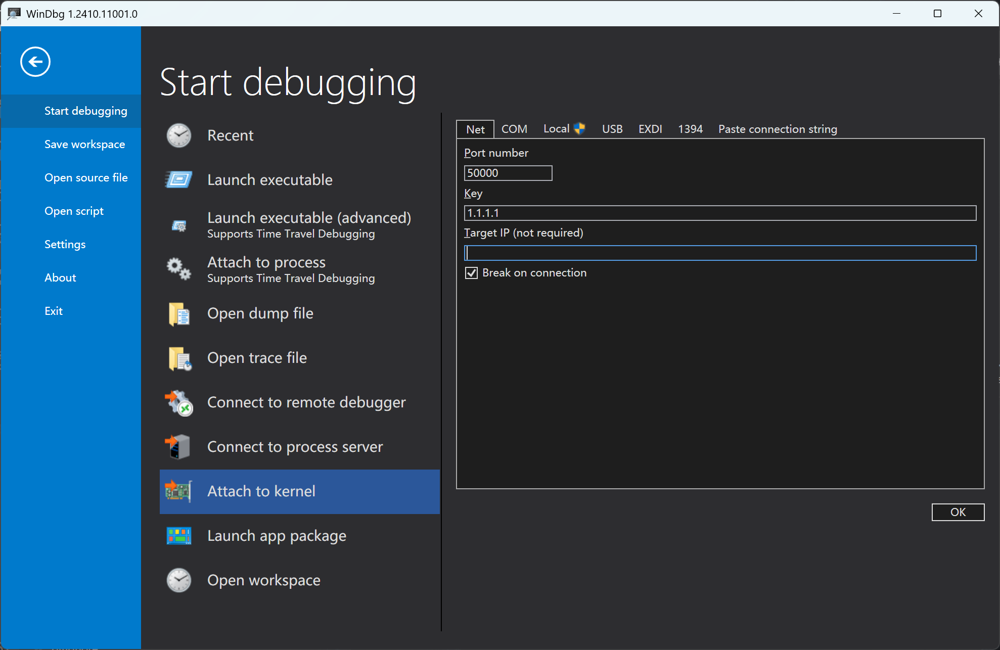
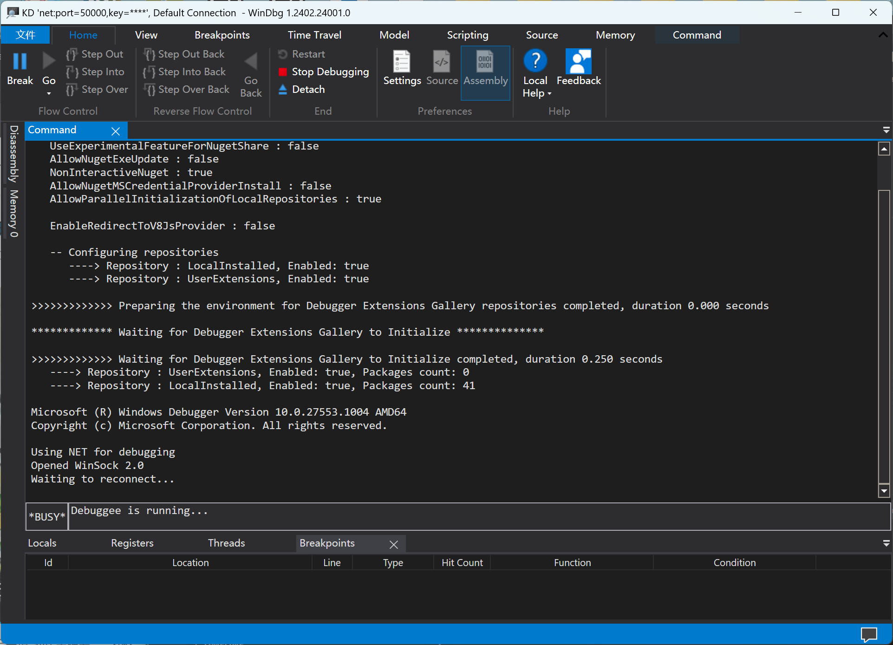

# Setup Windbg KDNET

## Preparation
  - A device with windows installed as debugging slave.
  - UEFI Image
  - An windows device with [windbg preview](https://apps.microsoft.com/detail/9pgjgd53tn86) installed as debugging host.
  - USB Cable

## Setup BCD
  - Mount ESP Partition on you phone with root permission in adb shell or termux.
    + Simply jump this step if you are using USB mass storage mode.
    ```bash
    # Execute on phone
    mkdir /dev/esp_mnt
    mount /dev/block/by-name/esp /dev/esp_mnt
    ```
  - Copy BCD to your host computer.
    + If you are using UMS, find the BCD file and copy it to D: or anywhere you want in explorer.
    + Copy to /sdcard
    ```bash
    # Execute on phone
    cp /dev/esp_mnt/EFI/Microsoft/Boot/BCD /sdcard
    ```
    + Pull to computer.
    ```powershell
    # Execute on computer, assuming installed adb.
    # Assuming copy to D:, you can set any path you want.
    adb pull /sdcard/BCD D:\
    ```
  - Open an **administrator** terminal and set bcd configurations.
    ```powershell
    cd D:\
    bcdedit /store BCD /set "{default}" testsigning on
    bcdedit /store BCD /set "{default}" nointegritychecks on
    bcdedit /store BCD /set "{default}" debug on 
    bcdedit /store BCD /dbgsettings net hostip:169.254.255.255 port:50000 key:1.1.1.1
    ```
  - Push BCD back to your phone.
    + If you are using UMS, simply replace the original BCD file.
    ```powershell
    # Execute on computer
    adb push BCD /sdcard
    # Delete BCD after pushing
    del D:\BCD
    ```
    ```bash
    # Execute on phone
    # Backup nomal BCD
    cp /dev/esp_mnt/EFI/Microsoft/Boot/BCD /dev/esp_mnt/EFI/Microsoft/Boot/NMBCD
    # Backup kdnet enabled BCD
    cp /sdcard/BCD /dev/esp_mnt/EFI/Microsoft/Boot/DBGBCD
    # Replace active BCD
    cp /sdcard/BCD /dev/esp_mnt/EFI/Microsoft/Boot/BCD
    ```

### Setup KDNET in Windbg
  - Opne Windbg(Preview)，Click the **File** button on the top left corner
  - Click `Attach to kernel` under `Start debugging`(default section).
  - Click `Net`(default section)
    + Type `50000` in `Port Number`
    + Type `1.1.1.1` in `Key`
  
  - Click `OK` button on the bottom
  

### Connect slave device
  - Reboot your phone, and connect it to computer with a usb cable.
    ```powershell
    # Execute on computer, boot uefi
    fastboot boot uefi.img
    ```
  - If all configurations were done correctly, your phone will hang up at windows logo without a loading circle.
  - Open a device manager or task manager, you can find a network card named KdNET EEM.
  - Ensure your windbg is opened, after several minutes it will print logs after successfully connected to phone server.
  - Windows on phone will load once windbg connected.
  - You can press `Ctrl+Alt+V` to enable verbose mode for checking driver loading status.
  - End
  